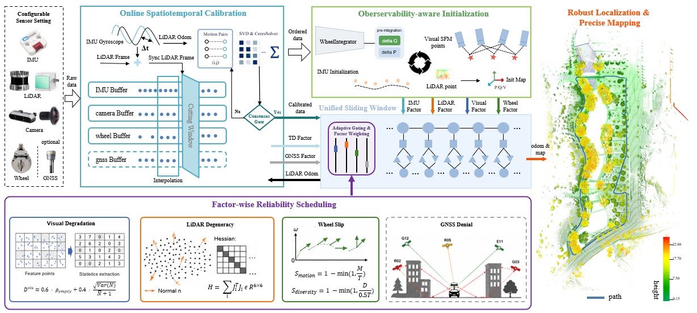
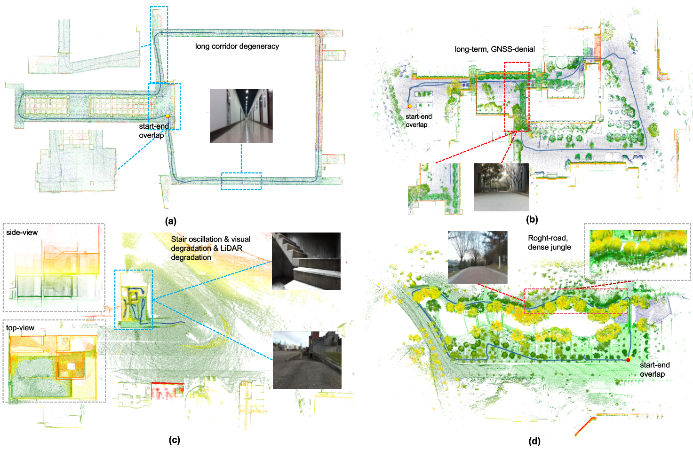
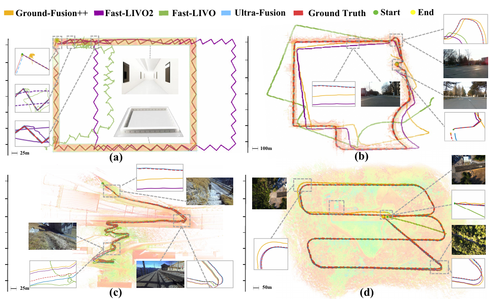

# Ultra-Fusion: A Resilient Tightly-Coupled Multi-Sensor Fusion SLAM Framework under Sensor Degradation and Spatiotemporal Perturbation for Intelligent Transportation Systems

<div align="center">

[](https://sjtuyinjie.github.io/ultrafusion-web/)
[](#cross-platform-results)
[](#license)

</div>

Ultra-Fusion is a tightly-coupled multi-sensor SLAM/localization framework for intelligent transportation systems (ITS).
It is designed for real deployment where sensor degradation (illumination changes, LiDAR degeneracy, wheel slippage, GNSS outage) and spatiotemporal miscalibration are common.

The system unifies WIO, VIO, LIO, and LVIO in one configurable optimization framework, with optional wheel/GNSS fusion and online calibration.

> [!NOTE]
> We currently release executable binaries and demos. Full source code will be released after paper acceptance.

---

## Highlights

- Unified sliding-window estimator with timestamp-ordered heterogeneous factors.
- Observability-aware initialization for robust bootstrap under diverse motion/sensor conditions.
- Factor-wise reliability scheduling (FRS) to gate/down-weight degraded measurements.
- Online LiDAR-IMU spatiotemporal calibration during operation.
- Validated on wheeled, legged, and aerial platforms across multiple public benchmarks.

---

## Method Overview

Ultra-Fusion converts asynchronous sensor streams into optional factors in one optimization window, with shared state representation, marginalization, and calibration logic.

<p align="center">
  
</p>
<p align="center"><em>Unified pipeline: initialization, reliability scheduling, online calibration, and multi-modal fusion in one framework.</em></p>

---

## Why Ultra-Fusion

Compared with conventional fusion pipelines that are heavily tied to a fixed sensor set, Ultra-Fusion emphasizes:

1. **Configurability**: one framework for WIO/VIO/LIO/LVIO (+ wheel/GNSS).
2. **Reliability**: robust localization under corner-case degradations.
3. **Deployability**: support for long-term and high-speed operation in real ITS scenarios.
4. **Transferability**: validated beyond wheeled robots to legged and aerial platforms.

---

## Qualitative Results

### Robustness Under Degradation

<p align="center">
  
</p>
<p align="center"><em>Representative stress cases: challenging perception conditions with consistent trajectory and map quality.</em></p>

### Cross-Platform Results

<p align="center">
  
</p>
<p align="center"><em>Trajectory estimation examples on ground, legged, and UAV datasets.</em></p>


## Benchmarks and Findings

Ultra-Fusion is evaluated on:

- [**M3DGR**](https://github.com/sjtuyinjie/M3DGR) (including simulation extension),
- [**M2DGR-Plus**](https://github.com/SJTU-ViSYS/M2DGR-plus)(wheeled),
- [**KAIST (Complex Urban Dataset)**](https://sites.google.com/view/complex-urban-dataset)(autonomous driving),
- [**GrandTour**](https://github.com/leggedrobotics/grand_tour_dataset) (legged),
- [**MARS-LVIG**](https://mars.hku.hk/dataset.html) (aerial).

Across these datasets, the paper reports competitive localization performance and improved availability under:

- sensor degradation (visual/LiDAR/wheel/GNSS),
- temporal/extrinsic perturbations,
- long-duration and high-speed operation.

---

## Quick Start

> Build and run scripts will be released/updated in this repository.

### Dependencies

- Ubuntu + ROS (recommended)
- Ceres, Eigen, Sophus, PCL
- Multi-sensor inputs (camera / IMU / LiDAR / wheel / GNSS as available)

### Build

```bash
# TODO: provide official setup scripts for Ultra-Fusion release
```

### Run

```bash
# TODO: provide launch commands and sample configs
```

---

## Datasets

- [M3DGR](https://github.com/sjtuyinjie/M3DGR)
- [M2DGR-Plus](https://github.com/sjtuyinjie/M2DGR-plus)

More benchmark links and sequence-level setup instructions will be added with the release package.

---

## Citation

If you find this project useful, please cite:

```bibtex
@article{zhang2025towards,
  title={Towards Robust Sensor-Fusion Ground SLAM: A Comprehensive Benchmark and A Resilient Framework},
  author={Zhang, Deteng and Zhang, Junjie and Sun, Yan and Li, Tao and Yin, Hao and Xie, Hongzhao and Yin, Jie},
  journal={arXiv preprint arXiv:2507.08364},
  year={2025}
}
```

---

## License

This project is licensed under the MIT License.
